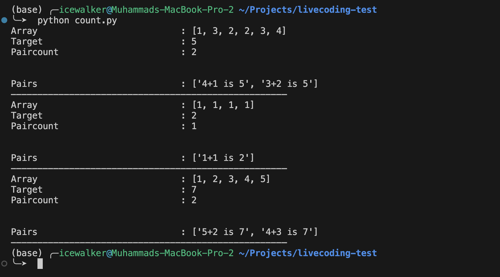

# Python Live Coding Test
This is code for live coding test and recorded screen.
## Description
Recorded screen can be accessed on this link [Live Coding Test](https://drive.google.com/file/d/1xj-I-3yEfWY-bt9v7ls5ESv7T8OB6wxo/view?usp=sharing)
## Getting Started
```
python count.py
```

## Screenshot of Result
